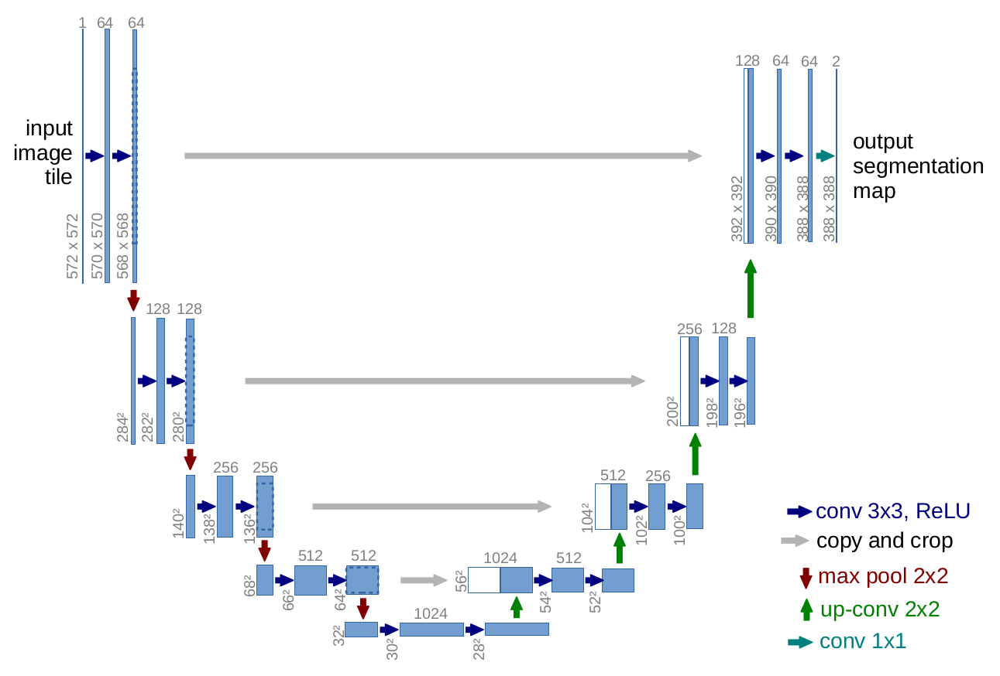

# Implementing U-Net using the TensorFlow Estimator API

This repository contains scripts for building, training, and generating predictions with our own implementation of the U-Net architecture. The network was implemented in Python using TensorFlow's Estimator API. Our goal was to reproduce the U-Net architecture described in [1], then train the network on data provided by the Carvana Image Masking Challenge hosted on Kaggle [2]. Our implementation produced masks with average pixel accuracy of 0.9959 +/- 0.0003 over a 6-fold cross-validation set.

Example masks produced by a single network trained on one fold of the cross-validation set can be seen below. 

(EXAMPLE MASKS)

## Description of the original U-Net architecture

U-Net is a deep, fully convolutional neural network architecture proposed for biomedical image segmentation. A visual representation of the network, as shown in the original publication [1], can be found below.

## Differences between our implementation and the original architecture

## Summaries of each file

## Running the program

## References

1.  **U-Net: Convolutional Networks for Biomedical Image Segmentation**  
    Olaf Ronneberger, Philipp Fischer, Thomas Brox.  
    [[link]](https://arxiv.org/pdf/1505.04597.pdf). arXiv:1505.04597, 2015.

2.  **Carvana Image Masking Challenge**  
    Carvana LLC.  
    [[link]](https://www.kaggle.com/c/carvana-image-masking-challenge). Kaggle, 2017.
